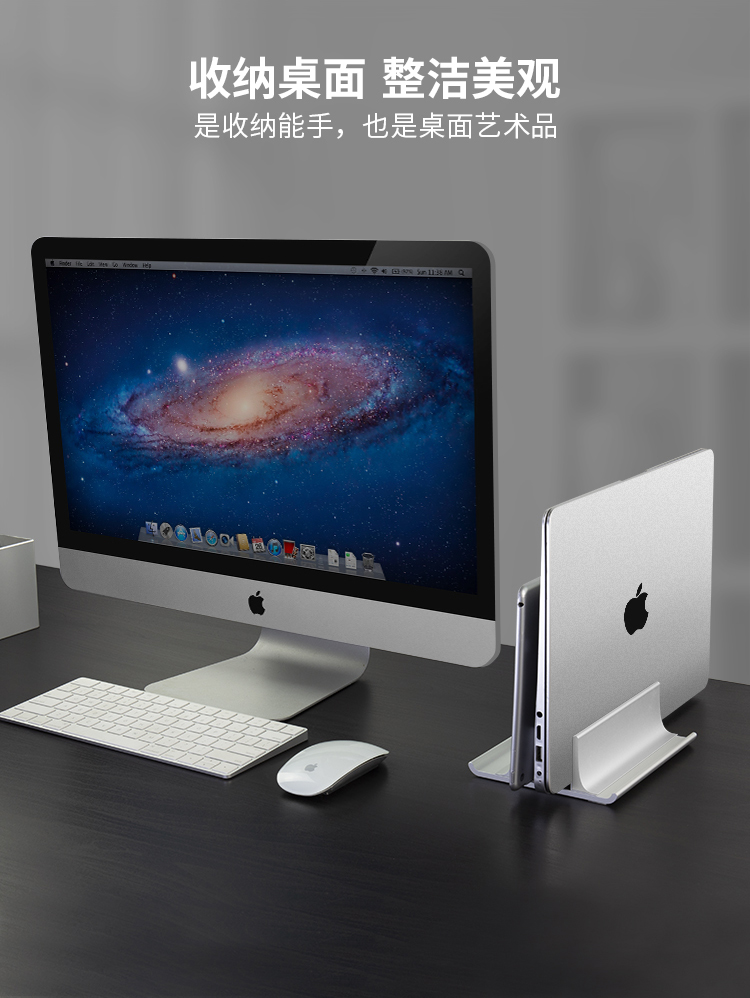
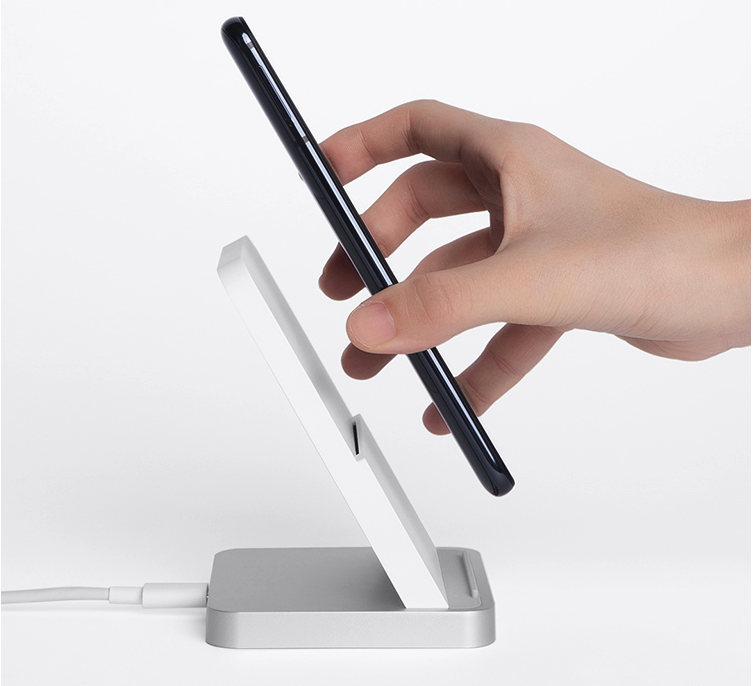

## 程序员工作桌面

简洁，舒适的工作台是提升工作效率的基础。


> MacBook Pro

MacBook Pro 13" 是工作主力，搭配“笔记本立式支架”，可将笔记本折叠、立式存放，极大地节约了桌面空间。

笔记本立式支架：



链接：https://item.jd.com/100007844258.html


> 显示器

AOC 27寸 显示器

> 机械键盘+木质手托+妙控板

斐尔可Filco 87圣手二代 纯白色 机械键盘，茶轴

黑胡桃实木手托

机械键盘：https://item.jd.com/3759005.html

木质手托：https://item.jd.com/28547023901.html

> 小米30W无线快充



> 计时器/番茄钟


使用番茄工作法需要两个工具：

- 一个番茄计时器
- 一张 To Do Today计划表


标准的番茄工作法遵循以下规则：

1）一个番茄时间共30分钟，25分钟工作，5分钟休息；

2）一个番茄时间是不可分割的；

3）每 4 个番茄时间后，停止工作，进行一次较长时间的休息，大约 15-30 分钟；

4）完成一个任务，划掉一个


程序员的工作更加强调专注，所以对番茄工作法做了改进。

改进后的番茄工作法遵循以下规则：

```joson
1) 一个番茄时间共50分钟，45分钟工作，5分钟休息；
2) 一个番茄时间是不可分割的；
3) 每 2 个番茄时间后，停止工作，进行一个较长时间的休息，大约 15-30 分钟
4) 完成一个任务，划掉一个
```


番茄工作法的精髓：

1. 一次只做一件事，保持专注；
2. 按照轻重缓急程度分解目标任务，高效完成；
3. 做完一件划掉一件，增加成就感，避免半途而废；
4. 整理杂乱无章的工作事项，克服拖延症；
5. 持续改善时间管理能力，让优秀成为一种习惯。


参考资料：

- 《番茄工作法》

> Bose 耳机

Bose QuietComfort 35 II无线消噪耳机

听着歌，敲着代码，很专注，很舒服。