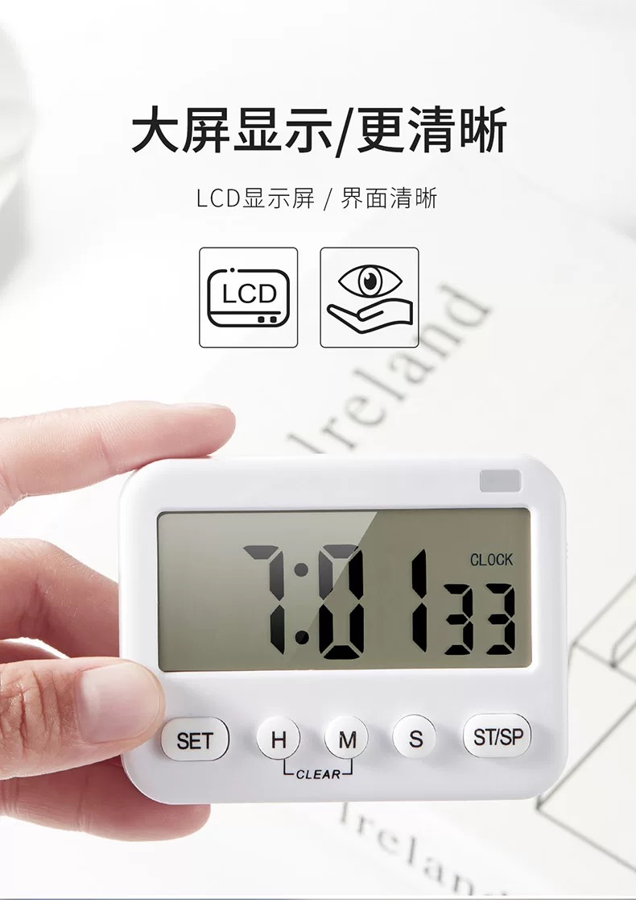

## 程序员工作桌面

简洁，舒适的工作台是提升工作效率的基础。

> MacBook Pro

MacBook Pro 13" 是工作主力，搭配笔记本立式支架，可将笔记本折叠、立式存放，极大地节约了桌面空间。

笔记本立式支架：

链接：https://item.jd.com/100007844258.html

> 显示器

AOC 27寸 显示器

> 机械键盘+木质手托+妙控板

斐尔可Filco 87圣手二代 纯白色 机械键盘，茶轴

黑胡桃实木手托

机械键盘：https://item.jd.com/3759005.html

木质手托：https://item.jd.com/28547023901.html

妙控板：https://www.apple.com.cn/shop/product/MRMF2CH/A?fnode=3a5fc09502af02cb75218a334e0c7e8a02fb5a1eb6cbd8dc9a4e8f14e8f5b8b32dd569ac155e5702de7679e3282aec89b1d19bda98e147bb89ba71112cf824cb9f316ee00b9d982446ae1a96a5375188b66d45d738c5167d815ae930b3a9857d

> 小米30W无线快充

> 计时器/番茄钟

> Bose 耳机

Bose QuietComfort 35 II无线消噪耳机

听着歌，敲着代码，很专注，很舒服。